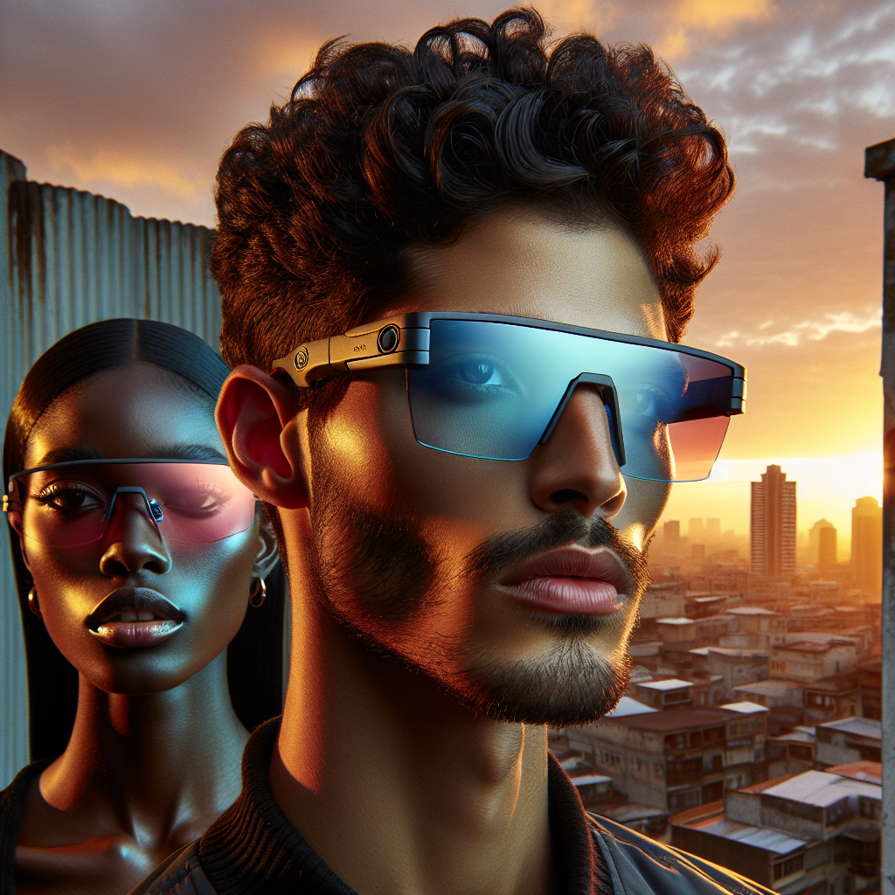

# 🕶️ Summer Sunglasses Campaign – Executive Summary

## 📊 Refined Trend Insights
Summer 2025 Sunglasses Campaign: Executive Summary

As we prepare to launch our Summer 2025 eyewear collection, three distinct trends have emerged as must-haves on runways, in street style and across social platforms. We’ve matched each trend to a high-potential SKU in our current inventory, ensuring that our campaign is both on-trend and inventory-optimized.

1. Sporty-Futuristic Wraparound Shields  
   • Trend Insight: Futuristic, single-lens shields are dominating at Dior, Prada and influencer feeds—conveying technical performance and high-energy appeal.  
   • Product Match: SG004 “Sport” Wraparound  
     – Features a curved, impact-resistant lens, rubberized temple grips and an ultra-light flexible frame.  
     – Inventory: 11 units in stock—sufficient for a targeted digital and in-store push.

2. Sculptural Cat-Eye & Retro Silhouettes  
   • Trend Insight: The ’50s/’60s feline silhouette is resurging as a power accessory—melding vintage glamour with contemporary confidence.  
   • Product Match: SG003 “Mystique” Cat-Eye  
     – Highlights include upswept corners and delicate temple embellishments for an elegant statement.  
     – Inventory: 3 units available—ideal for limited-edition launches and influencer gifting.

3. Minimal “Barely There” Frames  
   • Trend Insight: Understated ultra-light frames paired with vibrant tints and gradients appeal to modern consumers seeking versatility.  
   • Product Match: SG005 “Round” Minimalist  
     – Slim metal rims and perfectly round lenses designed to showcase bold lens colors.  
     – Inventory: 10 units ready for a color-centric summer rollout.

Campaign Rationale  
– Market Alignment: Each style directly reflects the technical silhouettes, heritage nods and low-key luxe metals driving SS25 editorials and social media buzz.  
– Inventory Efficiency: Current stock levels support a focused promotion that minimizes overstock risk while maximizing sell-through potential.  
– Broad Appeal: These three silhouettes flatter a wide range of face shapes and lifestyle segments—from performance enthusiasts to fashion-minded trendsetters.

Recommendation  
Proceed with a coordinated digital, wholesale and retail campaign spotlighting these three styles. Leverage influencer partnerships and targeted social-ad creative to amplify runway credibility, and position our SKU selection as the definitive Summer 2025 eyewear edit.

## 🎯 Campaign Visual

    

## ✍️ Campaign Quote
Sunset Futurism: Sculptural Shields & Minimalist Flair

## ✅ Why This Works
The phrase “Sunset Futurism” mirrors the image’s warm urban dusk lighting and sporty-technical wraparound shields, “Sculptural Shields” nods to the bold cat-eye and futuristic silhouettes, and “Minimalist Flair” captures the ultra-light, slim-rim trend with vibrant lens tints—perfectly aligning with the SS25 forecast and our three key styles.

---

*Report generated on 2025-11-15*
