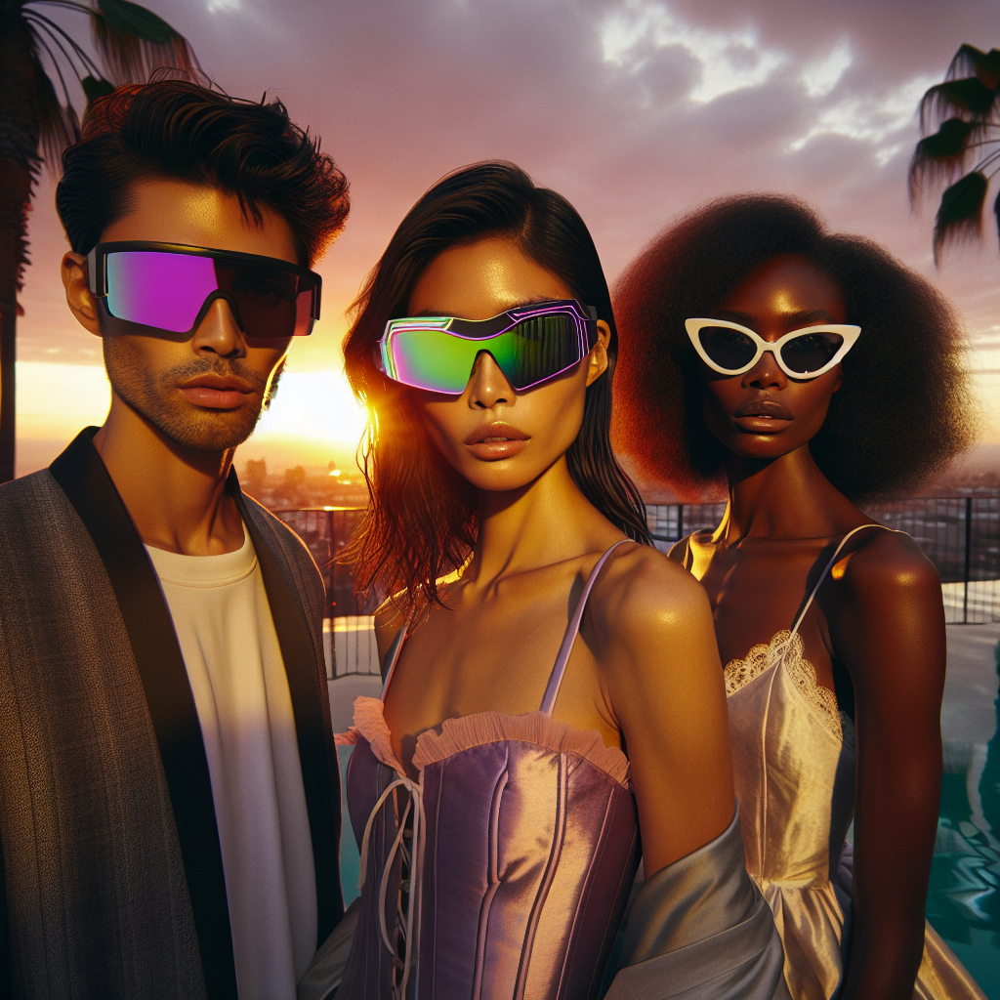

# 🕶️ Summer Sunglasses Campaign – Executive Summary

## 📊 Refined Trend Insights
Executive Summary: Summer 2025 Sunglasses Trends  
Date: November 15, 2025

Overview  
Our analysis identifies three dominant eyewear trends shaping consumer demand for Summer 2025. By aligning our product assortment with these trends, we can broaden market appeal, strengthen brand positioning and drive revenue across diverse customer segments.

Key Trends  
1. Oversized & Statement Frames  
   – Bold silhouettes (butterfly, square, oversized aviators) that maximize sun coverage and make an immediate style impact.  
2. Futuristic Shield & Wraparound Styles  
   – Sport-inspired “mask” lenses and streamlined shields, tapping into tech-wear aesthetics and active-lifestyle functionality.  
3. Retro-Inspired Classics  
   – Revived aviators, wayfarers, cat-eyes and round frames in color-tinted or transparent acetate, blending nostalgia with contemporary flair.

Recommended Summer Portfolio  
• Sport (SG004)  
  – Single curved lens, rubber grips, lightweight frame—perfect for active customers and tech-wear enthusiasts.  
• Aviator (SG001)  
  – Large teardrop lenses satisfy both the oversized-frame and heritage-classic trends while delivering premium UV protection.  
• Mystique (SG003)  
  – Elegant cat-eye profile infuses a vintage glamour that resonates with fashion-forward, style-driven shoppers.

Strategic Rationale  
• Diverse Segmentation: Our trio of models addresses athleisure, heritage-brand loyalists and trend-seeking influencers, ensuring broad customer engagement.  
• Trend Alignment: Each design directly mirrors a leading Summer 2025 eyewear movement, guaranteeing resonance across digital campaigns and in-store merchandising.  
• Operational Readiness: Current inventory levels (Sport: 11, Aviator: 23, Mystique: 3) and mid-premium price points ($144, $103, $88) support scalable promotions and healthy margins.

Conclusion  
This curated lineup seamlessly balances innovation, performance and classic appeal—positioning us to capitalize on Summer 2025’s most compelling sunglasses trends and drive meaningful growth.

## 🎯 Campaign Visual

    

## ✍️ Campaign Quote
Sunset Statement: Bold Frames, Futuristic Shields, Timeless Classics

## ✅ Why This Works
This phrase captures the image’s trio of oversized, shield-style, and retro cat-eye sunglasses against a sunset backdrop, while echoing the top summer 2025 trends—statement shapes, futuristic wraparounds, and vintage revivals.

---

*Report generated on 2025-11-15*
